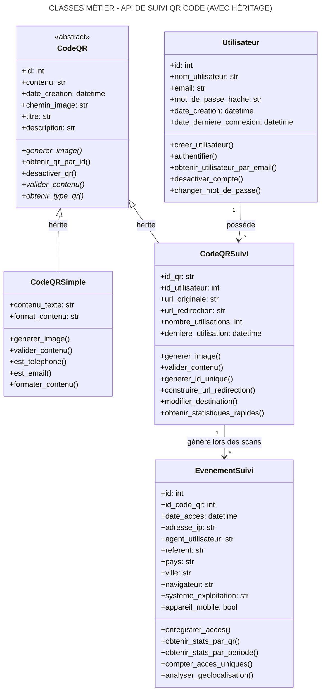

<!-- Diagramme avec héritage - Classes spécialisées -->
<!-- code à excécuter sur https://mermaid.js.org/syntax/classDiagram.html#syntax -->

```mermaid
---
title: CLASSES MÉTIER - API DE SUIVI QR CODE (AVEC HÉRITAGE)
---
classDiagram
    class Utilisateur {
        +id: int
        +nom_utilisateur: str
        +email: str
        +mot_de_passe_hache: str
        +date_creation: datetime
        +date_derniere_connexion: datetime
        +creer_utilisateur()
        +authentifier()
        +obtenir_utilisateur_par_email()
        +desactiver_compte()
        +changer_mot_de_passe()
    }

    class CodeQR {
        <<abstract>>
        +id: int
        +contenu: str
        +date_creation: datetime
        +chemin_image: str
        +titre: str
        +description: str
        +generer_image()*
        +obtenir_qr_par_id()
        +desactiver_qr()
        +valider_contenu()*
        +obtenir_type_qr()*
    }

    class CodeQRSimple {
        +contenu_texte: str
        +format_contenu: str
        +generer_image()
        +valider_contenu()
        +est_telephone()
        +est_email()
        +formater_contenu()
    }

    class CodeQRSuivi {
        +id_qr: str
        +id_utilisateur: int
        +url_originale: str
        +url_redirection: str
        +nombre_utilisations: int
        +derniere_utilisation: datetime
        +generer_image()
        +valider_contenu()
        +generer_id_unique()
        +construire_url_redirection()
        +modifier_destination()
        +obtenir_statistiques_rapides()
    }

    class EvenementSuivi {
        +id: int
        +id_code_qr: int
        +date_acces: datetime
        +adresse_ip: str
        +agent_utilisateur: str
        +referent: str
        +pays: str
        +ville: str
        +navigateur: str
        +systeme_exploitation: str
        +appareil_mobile: bool
        +enregistrer_acces()
        +obtenir_stats_par_qr()
        +obtenir_stats_par_periode()
        +compter_acces_uniques()
        +analyser_geolocalisation()
    }

    %% Relations d'héritage
    CodeQR <|-- CodeQRSimple : hérite
    CodeQR <|-- CodeQRSuivi : hérite

    %% Relations principales
    Utilisateur "1" --> "*" CodeQRSuivi : possède
    CodeQRSuivi "1" --> "*" EvenementSuivi : génère lors des scans

```
