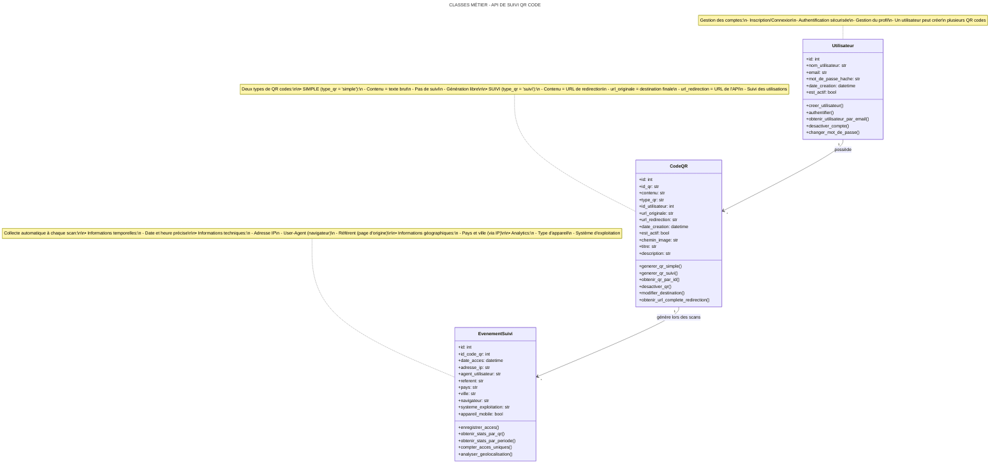

<!-- Diagramme des classes métier principales uniquement -->
<!-- code à excécuter sur https://mermaid.js.org/syntax/classDiagram.html#syntax -->

```mermaid
---
title: CLASSES MÉTIER - API DE SUIVI QR CODE
---
classDiagram
    class Utilisateur {
        +id: int
        +nom_utilisateur: str
        +email: str
        +mot_de_passe_hache: str
        +date_creation: datetime
        +est_actif: bool
        +creer_utilisateur()
        +authentifier()
        +obtenir_utilisateur_par_email()
        +desactiver_compte()
        +changer_mot_de_passe()
    }

    class CodeQR {
        +id: int
        +id_qr: str
        +contenu: str
        +type_qr: str
        +id_utilisateur: int
        +url_originale: str
        +url_redirection: str
        +date_creation: datetime
        +est_actif: bool
        +chemin_image: str
        +titre: str
        +description: str
        +generer_qr_simple()
        +generer_qr_suivi()
        +obtenir_qr_par_id()
        +desactiver_qr()
        +modifier_destination()
        +obtenir_url_complete_redirection()
    }

    class EvenementSuivi {
        +id: int
        +id_code_qr: int
        +date_acces: datetime
        +adresse_ip: str
        +agent_utilisateur: str
        +referent: str
        +pays: str
        +ville: str
        +navigateur: str
        +systeme_exploitation: str
        +appareil_mobile: bool
        +enregistrer_acces()
        +obtenir_stats_par_qr()
        +obtenir_stats_par_periode()
        +compter_acces_uniques()
        +analyser_geolocalisation()
    }

    %% Relations principales
    Utilisateur "1" --> "*" CodeQR : possède
    CodeQR "1" --> "*" EvenementSuivi : génère lors des scans
    
    %% Notes détaillées
    note for Utilisateur "Gestion des comptes:\n- Inscription/Connexion\n- Authentification sécurisée\n- Gestion du profil\n- Un utilisateur peut créer\n  plusieurs QR codes"
    
    note for CodeQR "Deux types de QR codes:\n\n• SIMPLE (type_qr = 'simple'):\n  - Contenu = texte brut\n  - Pas de suivi\n  - Génération libre\n\n• SUIVI (type_qr = 'suivi'):\n  - Contenu = URL de redirection\n  - url_originale = destination finale\n  - url_redirection = URL de l'API\n  - Suivi des utilisations"
    
    note for EvenementSuivi "Collecte automatique à chaque scan:\n\n• Informations temporelles:\n  - Date et heure précise\n\n• Informations techniques:\n  - Adresse IP\n  - User-Agent (navigateur)\n  - Référent (page d'origine)\n\n• Informations géographiques:\n  - Pays et ville (via IP)\n\n• Analytics:\n  - Type d'appareil\n  - Système d'exploitation"
```
